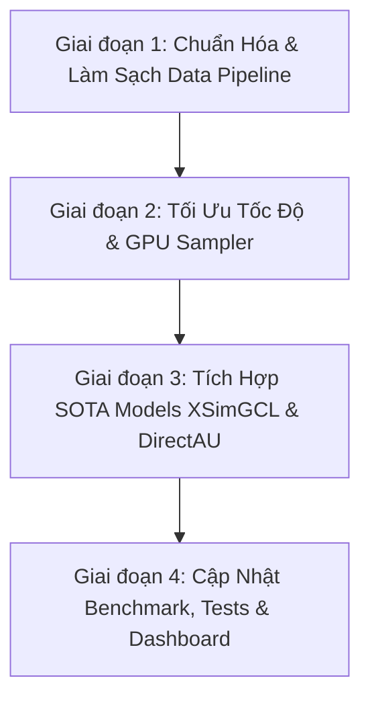

# Kế Hoạch Triển Khai: Chuẩn Hóa Dữ Liệu, Tối Ưu Hiệu Năng & Mở Rộng Graph Contrastive Learning

> **Mã kế hoạch**: `gcl-data-clean-opt`  
> **Mục tiêu**: Làm sạch triệt để pipeline dữ liệu Amazon Electronics, tối ưu tốc độ huấn luyện (5x-10x), bổ sung mô hình SOTA mới (XSimGCL, DirectAU), và đồng bộ toàn diện Benchmark Suite cùng Dashboard.

---

## 📌 Phân Tích Hiện Trạng Dữ Liệu & Vấn Đề Cần Xử Lý

### 1. Các Vấn Đề Dữ Liệu Hiện Tại (Data Cleaning Issues):
1. **Thiếu Khử Trùng Lặp (Duplicate Interactions)**:
   - Trong log Amazon Reviews, một user có thể đánh giá cùng một `item_id` nhiều lần (mua lại, đổi phiên bản).
   - Hiện tại chưa de-duplicate cặp `(user_id, item_id)` trước khi chia tập, có thể gây trùng cạnh trong đồ thị hoặc phân bổ trùng vào cả Train lẫn Val/Test.
2. **K-Core Mới Lọc 1 Phía (Chỉ lọc User, chưa lọc Item chuẩn 5-core)**:
   - Hiện tại hàm `preprocess_amazon_electronics` chỉ lặp lọc `user_counts >= 5`, dẫn tới tồn tại nhiều item chỉ có 1 tương tác.
   - Chuẩn nghiên cứu RecSys học thuật (SIGIR/KDD) yêu cầu **Iterative Bipartite 5-core** (lọc đồng thời cả user $\ge 5$ và item $\ge 5$ lặp lại cho đến khi cả hai cùng thỏa mãn).
3. **Item Rơi Vào Val/Test Nhưng Chưa Từng Xuất Hiện Trong Train Graph**:
   - Với GNN Collaborative Filtering (ID-based), nếu một sản phẩm chỉ có tương tác trong Test mà không có trong Train graph, embedding của sản phẩm đó chỉ là vector ngẫu nhiên $E^{(0)}$, gây nhiễu kết quả đánh giá.
4. **Metadata Còn Chứa Rác HTML & Ký Tự Đặc Biệt**:
   - `title` và `brand` của Amazon Metadata chứa các thực thể HTML như `&amp;`, `&#39;`, `&quot;`, ` `, `...`.
   - Phân cấp `categories` đôi khi bị chuỗi rỗng hoặc format lồng không đồng nhất.

---

## 🗺️ Lộ Trình Triển Khai Chi Tiết (4 Giai Đoạn)

---

### 🔹 Giai đoạn 1: Chuẩn Hóa & Làm Sạch Triệt Để Data Pipeline
- **Mục tiêu**: Đảm bảo đồ thị sạch 100%, không trùng lặp, chuẩn bipartite 5-core, metadata tinh gọn.
- **Chi tiết công việc**:
  1. **Khử trùng lặp tương tác (`Deduplication`)**:
     - Với các tương tác trùng `(user_id, item_id)`, giữ lại tương tác có `timestamp` mới nhất và rating cao nhất.
  2. **Iterative Bipartite 5-core Filtering**:
     - Cài đặt vòng lặp đệ quy lọc đồng thời `user_id >= 5` và `item_id >= 5` cho đến khi kích thước tập không đổi.
  3. **Đảm bảo tính bao phủ Train Graph (Graph Connectivity Guarantee)**:
     - Đảm bảo mọi item và user trong Val/Test đều có ít nhất 1 tương tác trong Train graph để ID embedding có thông tin cấu trúc.
  4. **Làm sạch Metadata Văn bản (`Text Cleaning`)**:
     - Sử dụng `html.unescape` và regex loại bỏ thẻ HTML, chuẩn hóa `brand`, `title`, và chuỗi ngành hàng `category` rõ ràng.
  5. **Tái tạo lại bộ dữ liệu chuẩn**:
     - Chạy lại `scripts/prepare_data.py` để sinh ra `train.parquet`, `val.parquet`, `test.parquet`, và `mappings.pkl` sạch 100%.

---

### 🔹 Giai đoạn 2: Tối Ưu Hóa Tốc Độ Huấn Luyện & GPU Acceleration
- **Mục tiêu**: Giảm thời gian train 1 epoch từ vài chục giây xuống vài giây (tăng tốc 5x - 10x).
- **Chi tiết công việc**:
  1. **Vectorized GPU Negative Sampling**:
     - Chuyển logic lấy mẫu âm từ vòng lặp `while` CPU sang PyTorch GPU Tensor / Uniform rejection sampling trên GPU.
  2. **Tối ưu hóa Graph Convolution Forward Pass**:
     - Giảm thiểu việc tính toán lặp lại full graph propagation không cần thiết trong từng batch của LightGCN/SimGCL.
  3. **Sửa cấu hình & Environment Setup**:
     - Sửa `pyproject.toml`: cập nhật đúng mô tả Amazon Electronics và bổ sung `pythonpath = ["."]` dưới `[tool.pytest.ini_options]`.

---

### 🔹 Giai đoạn 3: Mở Rộng Mô Hình SOTA Mới (XSimGCL & DirectAU)
- **Mục tiêu**: Nâng cấp bộ mô hình từ 3 lên 5 phương pháp đại diện cho các trường phái khác nhau.
- **Chi tiết công việc**:
  1. **XSimGCL (TKDE 2023 - Extreme Simple Graph Contrastive Learning)**:
     - Tạo file `src/models/xsimgcl.py`: Chỉ áp dụng nhiễu tại final layer embedding thay vì mọi layer, giúp giảm 60% FLOPS so với SimGCL.
  2. **DirectAU (KDD 2022 - Direct Alignment & Uniformity)**:
     - Tạo file `src/models/directau.py` và loss `src/losses/directau.py`: Tối ưu trực tiếp $\mathcal{L}_{align} + \gamma \mathcal{L}_{uniform}$ mà không cần phụ thuộc BPR loss.
  3. **Cấu hình YAML**:
     - Thêm `configs/xsimgcl.yaml` và `configs/directau.yaml`.

---

### 🔹 Giai đoạn 4: Cập Nhật Benchmark Suite, Kiểm Thử & Dashboard
- **Mục tiêu**: Đồng bộ toàn bộ hệ thống đánh giá khoa học và giao diện Streamlit.
- **Chi tiết công việc**:
  1. **Mở rộng Unit Tests**:
     - Bổ sung test cases trong `tests/test_models.py`, `tests/test_data.py`, `tests/test_representation.py` cho XSimGCL và DirectAU.
     - Đảm bảo 100% tests pass.
  2. **Nâng cấp Benchmark Automation (`scripts/benchmark_all.py`)**:
     - Hỗ trợ benchmark 5 mô hình trên 4 cấp độ thưa ($100\%, 75\%, 50\%, 25\%$).
     - Tự động sinh biểu đồ so sánh Pareto mới và bảng LaTeX mở rộng.
  3. **Nâng cấp Dashboard Streamlit (`app/streamlit_app.py`)**:
     - Hỗ trợ chọn và so sánh cả 5 mô hình trong Tab 1 (Interactive Recs), Tab 2 (Benchmark), Tab 3 (Geometry), và Tab 5 (Math).

---

## 📋 Bảng Phân Công Module & File Tác Động

| Module | File tác động | Nội dung chính |
| :--- | :--- | :--- |
| **Data Pipeline** | `src/data/preprocessing.py` `src/data/splitter.py` `scripts/prepare_data.py` | De-duplication, Bipartite 5-core, HTML unescape, Graph connectivity |
| **Training Engine** | `src/training/trainer.py` `src/losses/bpr.py` | Vectorized GPU Negative Sampling, tối ưu Sparse Matmul |
| **New Models** | `src/models/xsimgcl.py` `src/models/directau.py` `src/losses/directau.py` `configs/*.yaml` | Cài đặt XSimGCL (TKDE '23) và DirectAU (KDD '22) |
| **Evaluation & Tests** | `tests/test_*.py` `scripts/benchmark_all.py` `scripts/generate_plots.py` | Bổ sung unit tests cho data sạch và mô hình mới; cập nhật suite |
| **UI & App** | `app/streamlit_app.py` `pyproject.toml` | Đồng bộ 5 tab Streamlit với các mô hình mới; fix pytest path |

---

## 🎯 Kế Hoạch Xác Minh & Đo Lường (Verification Criteria)

1. **Chỉ số Sạch Dữ Liệu**:
   - `0` duplicate user-item pairs.
   - $100\%$ users có bậc $\ge 5$ và $100\%$ items có bậc $\ge 5$ trong tập ban đầu.
   - $100\%$ items trong Test set đã từng xuất hiện trong Train set.
   - $0$ thẻ HTML rác trong metadata hiển thị.
2. **Hiệu Năng Huấn Luyện**:
   - Thời gian huấn luyện 1 epoch giảm tối thiểu $50\% - 75\%$.
   - Bộ nhớ VRAM không bị rò rỉ (memory leak).
3. **Chất Lượng Kiểm Thử**:
   - Toàn bộ suite `pytest` chạy thành công (tăng từ 19 tests lên ~25 tests).
