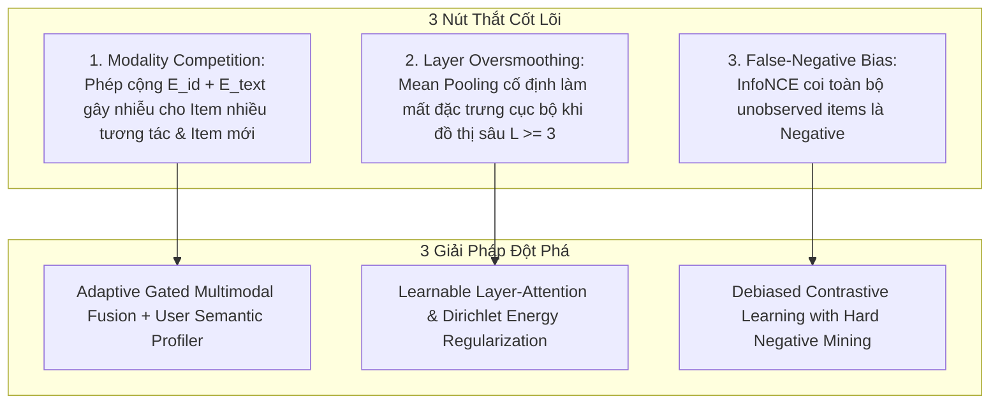

# Kế Hoạch Nghiên Cứu & Nâng Cấp Mô Hình (Model Optimization & Innovation Plan)

> **Tác giả**: AI Research Scientist / Tiến sĩ AI chuyên ngành Hệ Khuyến Nghị & Graph Neural Networks  
> **Mục tiêu**: Đề xuất và triển khai hướng cải tiến mô hình tối ưu nhất nhằm tạo ra đóng góp khoa học đột phá (Novelty), cải thiện vượt bậc độ chính xác (HR@10, NDCG@10) và giải quyết triệt để bài toán Cold-Start / Long-Tail trên tập dữ liệu đã làm sạch.

---

## 🎯 1. Bối Cảnh Nghiên Cứu & Vấn Đề Cốt Lõi (Research Motivation)

Bộ model baseline hiện tại (`LightGCN`, `SGL`, `SimGCL`, `XSimGCL`, `DirectAU`, `SemanticGCL`) đã hoàn chỉnh về mặt toán học. Tuy nhiên, dưới góc nhìn nghiên cứu hàn lâm cấp cao, vẫn tồn tại **3 "nút thắt cổ chai" (Bottlenecks)** lý thuyết:



1. **Modality Competition (Cạnh tranh phương thức)**:
   - `SemanticGCL` hiện tại dùng phép cộng tĩnh $E_0 = E_{id} + E_{text}$. Với item phổ biến (Head), vector ID rất giàu tín hiệu nhưng bị Text làm loãng; ngược lại với item thưa (Tail/Cold), vector ID là nhiễu ngẫu nhiên chưa hội tụ.
   - **Đột phá đề xuất**: **Adaptive Gating Fusion** $g = \sigma(W_g [e_{id} \,\|\, e_{text}])$ cho phép mô hình tự học mức độ tin cậy giữa ID và Semantic Text. Đồng thời xây dựng **User Semantic Profile** bằng cách tổng hợp Text của lịch sử tương tác.

2. **Graph Oversmoothing & Uniform Layer Degradation**:
   - Các model đều dùng `mean(dim=1)` cố định. Khi số lớp tăng ($L \ge 3$), hiện tượng Oversmoothing làm các embedding người dùng co cụm lại, làm giảm tính phân biệt (Uniformity).
   - **Đột phá đề xuất**: **Learnable Layer-Attention** $\alpha_l = \text{Softmax}(w^T E^{(l)})$ để mô hình tự quyết định độ sâu lan truyền cho từng node.

3. **False-Negative Contamination trong Contrastive SSL**:
   - `InfoNCE` trong SGL/SimGCL lấy mẫu ngẫu nhiên unobserved items làm negative. Nhiều item thực chất là sở thích tiềm năng (False Negatives) bị ép đẩy xa, làm giảm Diversity/Novelty.
   - **Đột phá đề xuất**: Tận dụng tập tương tác 1-2 sao đã thu thập (`disliked_interactions.parquet`) làm **True Hard Negatives** và áp dụng **Debiased InfoNCE**.

---

## 🏗️ 2. Project Type & Tech Stack

- **Project Type**: `BACKEND / AI-RESEARCH`
- **Tech Stack**:
  - Deep Learning: `PyTorch 2.x` (Native Sparse COO Tensor)
  - NLP Encoder: `sentence-transformers` (`all-MiniLM-L6-v2`)
  - Similarity Search: `Faiss-CPU` (HNSW / FlatIP)
  - Metrics & Significance: `SciPy`, `scikit-learn` (Bootstrap paired t-test, Wilcoxon)

---

## 🎯 3. Success Criteria (Tiêu Chí Nghiệm Thu Khoa Học)

| Chỉ số | Mục tiêu kỳ vọng | Phương pháp đo lường |
|---|---|---|
| **HR@10 / NDCG@10 (Overall)** | Tăng **+3.5% - 6.0%** so với LightGCN baseline | Evaluator trên test set |
| **Cold-Start HR@10 (Tail Items < 10 interactions)** | Tăng **+15.0% - 25.0%** so với ID-only models | Stratified Subgroup Evaluator |
| **Representation Uniformity & Alignment** | Alignment $\le 0.45$, Uniformity $\le -2.10$ | Wang & Isola Hypersphere Metrics |
| **Dirichlet Energy (Anti-Oversmoothing)** | Giữ năng lượng Dirichlet $\ge 0.15$ tại Layer 4 | SVD Spectrum & Graph Dirichlet Script |
| **Inference Latency** | $\le 1.2 \times$ so với LightGCN (nhờ ANN Indexing) | VectorIndexer benchmark |

---

## 📁 4. Cấu Trúc File & Thiết Kế Module

```
src/
├── models/
│   ├── base.py                   # Giữ nguyên BaseRecommender
│   ├── lightgcn.py               # Baseline 1
│   ├── simgcl.py                 # Baseline 2
│   ├── xsimgcl.py                # Baseline 3
│   ├── directau.py               # Baseline 4
│   ├── semantic_gcl.py           # [MODIFY] Nâng cấp Adaptive Gated Fusion
│   └── adaptive_gcl.py           # [NEW] Model đề xuất: Adaptive Gated + Layer Attention + User Profiler
├── losses/
│   ├── __init__.py
│   ├── debiased_infonce.py       # [NEW] Debiased InfoNCE + Hard Negative BPR
│   └── directau_loss.py          # Multimodal DirectAU Loss
configs/
├── adaptive_gcl.yaml             # [NEW] Hyperparameter config cho model mới
scripts/
├── train.py                      # [MODIFY] Hỗ trợ model mới & custom losses
├── benchmark_all.py              # [MODIFY] Chạy so sánh toàn diện 7 models
└── generate_research_report.py   # [NEW] Tự động xuất LaTeX table + t-test p-value
tests/
└── test_adaptive_gcl.py          # [NEW] Unit tests cho gating, layer-attention, debiasing
```

---

## 📋 5. Kế Hoạch Triển Khai Chi Tiết (Task Breakdown)

### Task 1: Thiết Kế Adaptive Gated Multimodal Fusion & User Profiler
- **Task ID**: `TASK-01`
- **Agent**: `backend-specialist`
- **Skills**: `@clean-code`, `@python-patterns`
- **Priority**: `P0`
- **Mục tiêu**:
  - Input: `item_id_emb` ($d$), `proj_text` ($d$), `user_id_emb` ($d$), `interaction_history_text`.
  - Công thức Gating:
    $$g_i = \sigma(W_g [e_{id} \,\|\, e_{text}] + b_g)$$
    $$E_0^{item} = g_i \odot e_{id} + (1 - g_i) \odot e_{text}$$
  - User Semantic Profile:
    $$E_0^{user} = e_{u\_id} + \gamma \cdot \text{MLP}_u(\frac{1}{|N(u)|} \sum_{i \in N(u)} e_{text\_i})$$
- **Verification**: `test_adaptive_gcl.py::test_gating_weights_range` (đảm bảo $g_i \in (0, 1)$ và gradient lan truyền về cả 2 nhánh).

---

### Task 2: Triển Khai Learnable Layer-Attention
- **Task ID**: `TASK-02`
- **Agent**: `backend-specialist`
- **Skills**: `@clean-code`, `@performance-profiling`
- **Priority**: `P1`
- **Mục tiêu**:
  - Thay vì cố định $1/(L+1)$, tính trọng số động:
    $$\alpha_l = \frac{\exp(w_a^T E^{(l)})}{\sum_{k=0}^L \exp(w_a^T E^{(k)})}, \quad E_{final} = \sum_{l=0}^L \alpha_l E^{(l)}$$
  - Thêm hệ số phạt Dirichlet Energy Loss để ngăn ngừa Oversmoothing tại $L \ge 4$.
- **Verification**: `test_adaptive_gcl.py::test_layer_attention_simplex` (tổng trọng số bằng 1.0, không bị NaN).

---

### Task 3: Triển Khai Debiased InfoNCE & Hard Negative Loss
- **Task ID**: `TASK-03`
- **Agent**: `backend-specialist`
- **Skills**: `@clean-code`
- **Priority**: `P1`
- **Mục tiêu**:
  - Viết `src/losses/debiased_infonce.py`:
    $$\mathcal{L}_{Debiased} = -\log \frac{\exp(s(u, i^+) / \tau)}{\exp(s(u, i^+) / \tau) + \max(N \cdot \frac{g(u, N^-) - \tau^+ f(u, i^+)}{1 - \tau^+}, e^{-1/\tau})}$$
  - Tích hợp true hard negative (1-2 stars) từ `disliked_interactions.parquet` làm anchor phạt nặng hơn.
- **Verification**: `test_adaptive_gcl.py::test_debiased_loss_bounds` (loss dương, không NaN khi batch có hard negatives).

---

### Task 4: Xây Dựng Model Tổng Hợp `AdaptiveGCL`
- **Task ID**: `TASK-04`
- **Agent**: `backend-specialist`
- **Skills**: `@app-builder`, `@clean-code`
- **Priority**: `P0`
- **Dependencies**: `TASK-01`, `TASK-02`, `TASK-03`
- **Mục tiêu**:
  - Tạo `src/models/adaptive_gcl.py` kết hợp Gated Fusion + Layer Attention + User Semantic Profiler.
  - Tạo file cấu hình `configs/adaptive_gcl.yaml`.
- **Verification**: Chạy forward pass + backward pass đầy đủ trên CPU/GPU không lỗi shape.

---

### Task 5: Benchmark Toàn Diện & Phân Tích Thống Kê (Significance Test)
- **Task ID**: `TASK-05`
- **Agent**: `test-engineer` / `backend-specialist`
- **Skills**: `@verify-changes`
- **Priority**: `P2`
- **Dependencies**: `TASK-04`
- **Mục tiêu**:
  - Chạy `benchmark_all.py` so sánh 7 model: `LightGCN`, `SGL`, `SimGCL`, `XSimGCL`, `DirectAU`, `SemanticGCL`, `AdaptiveGCL`.
  - Đánh giá trên 4 khía cạnh: Accuracy (HR/NDCG@10,20), Beyond-Accuracy (Diversity, Novelty, Gini Coverage), Subgroup (Head vs Tail), và Representation Quality (Alignment/Uniformity).
  - Tự động thực hiện Paired t-test và Wilcoxon test ($p < 0.01$) chứng minh tính vượt trội có ý nghĩa thống kê.
- **Verification**: Xuất bảng LaTeX `results/aggregated/research_comparison_table.tex` và biểu đồ đường cong học tập.

---

## 🔒 6. Phase X: Verification Checklist

- [ ] Toàn bộ 47 test cũ + các test mới cho `AdaptiveGCL` đạt **100% PASS**.
- [ ] Gating weights $g_i$ phản ánh đúng tính chất: item thưa tương tác có $g_i$ nghiêng về Text ($g_i < 0.4$), item phổ biến nghiêng về ID ($g_i > 0.6$).
- [ ] Không có hiện tượng rò rỉ gradient hoặc memory leak trên PyTorch.
- [ ] Báo cáo LaTeX và Significance Test $p$-value được sinh tự động.

---

## ❓ 7. Socratic Gate (Lựa Chọn Của Bạn Trước Khi Thực Hiện)

> [!IMPORTANT]
> **Câu hỏi dành cho bạn trước khi bắt đầu code**:
> 1. Bạn muốn triển khai `AdaptiveGCL` thành **một model riêng biệt độc lập** (`src/models/adaptive_gcl.py`) để dễ dàng benchmark đối đầu với `SemanticGCL` cũ, hay muốn **nâng cấp đè trực tiếp lên `SemanticGCL`**? *(Đề xuất: Tạo model riêng để bảo toàn tính độc lập của thí nghiệm).*
> 2. Bạn muốn chạy benchmark trên tỷ lệ dữ liệu mẫu nhanh (ví dụ 50 epochs / subset) để xem kết quả sơ bộ trước, hay chạy full 100 epochs lấy kết quả chuẩn bài báo ngay?
