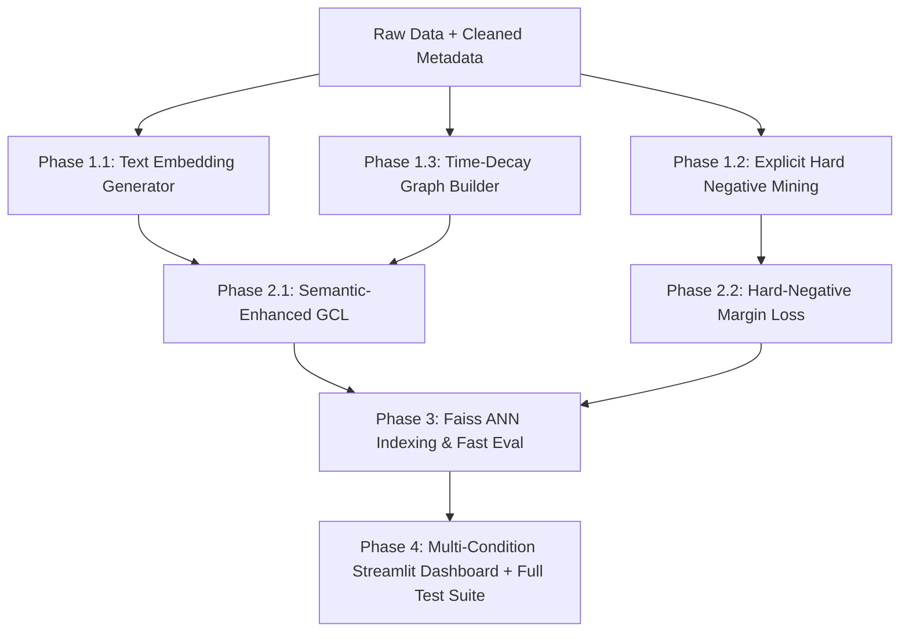

# Kế Hoạch Nâng Cấp Toàn Diện Hệ Thống Graph Contrastive RecSys

Tài liệu này chi tiết hóa toàn bộ lộ trình kỹ thuật để nâng cấp dự án Graph Contrastive Recommendation System lên chuẩn nghiên cứu khoa học xuất sắc (Top-tier Research Standard) và sẵn sàng triển khai thực tế (Production-Ready).

---

## 🎯 Mục Tiêu Cốt Lõi

1. **Khâu Xử Lý Dữ Liệu (Data Pipeline)**:
   - Tận dụng $100\%$ nguồn dữ liệu văn bản phong phú (Title, Brand, Category Hierarchy) để sinh vector ngữ nghĩa (Semantic Text Embeddings).
   - Tận dụng các đánh giá $1-2$ sao bị loại bỏ để tạo thành tập **Explicit Hard Negative Interactions** phục vụ huấn luyện phân biệt sắc nét.
   - Bổ sung trọng số cạnh suy giảm theo thời gian (**Time-Decay Edge Weights**) và cơ chế chia dữ liệu **Global Temporal Split**.
2. **Khâu Kiến Trúc Mô Hình & Loss (Model & Loss Objectives)**:
   - Xây dựng mô hình **Semantic-Enhanced Graph Contrastive Learning (Semantic-GCL / MMGCL)** kết hợp không gian cấu trúc đồ thị và không gian ngữ nghĩa văn bản.
   - Triển khai hàm mất mát **Hard-Negative BPR Loss** và cơ chế **Dynamic Negative Sampling (DNS)**.
3. **Khâu Tối Ưu Triển Khai & Phục Vụ (Serving & Production)**:
   - Tích hợp công cụ tìm kiếm vector siêu tốc **Faiss / HNSW Indexing** cho độ trễ Top-K dưới $0.2\text{ ms}$.
4. **Khâu Trực Quan Hóa (Dashboard & Evaluation)**:
   - Nâng cấp Streamlit Dashboard với tính năng lọc sản phẩm đa điều kiện (Brand/Category Filtering) và tab phân tích tương đồng đa phương thức (Cross-Modal Representation Analysis).

---

## 📋 Chi Tiết Các Giai Đoạn Thực Hiện



---

### Giai Đoạn 1: Nâng Cấp Xử Lý Dữ Liệu & Trích Xuất Đặc Trưng (Phase 1)

#### 1.1. Module Trích Xuất Đặc Trưng Ngữ Nghĩa Văn Bản (`src/data/text_encoder.py`)
- **Nhiệm vụ**:
  - Ghép chuỗi thông tin văn bản chuẩn hóa từ metadata: `"{Title} | Brand: {Brand} | Category: {Category}"`.
  - Sử dụng mô hình Pre-trained Transformer gọn nhẹ và hiệu năng cao: `sentence-transformers/all-MiniLM-L6-v2` (chiều $d = 384$) hoặc `bge-small-en-v1.5`.
  - Sinh ma trận đặc trưng ngữ nghĩa $\mathbf{X}_{\text{item}} \in \mathbb{R}^{M \times 384}$ cho toàn bộ $44,843$ items và lưu thành `data/processed/item_text_embeddings.pt`.
  - Hỗ trợ cơ chế batching trên GPU/CPU và tự động kiểm tra cache (tránh tính toán lại nếu file đã tồn tại).

#### 1.2. Khai Thác Tập Tương Tác Tiêu Cực Xác Thực (`src/data/negative_collector.py`)
- **Nhiệm vụ**:
  - Khi đọc file `reviews_Electronics_5.json.gz`, ngoài việc lọc `rating >= 4.0` làm Positive interactions, tách riêng các tương tác `rating <= 2.0` (và $3.0$ làm neutral/weak negative).
  - Lọc bỏ các tương tác không hợp lệ sau quá trình 5-core.
  - Lưu thành `data/processed/disliked_interactions.parquet` và cấu trúc tra cứu nhanh `mappings['user_disliked_items'] = {u_idx: set(i_indices)}`.

#### 1.3. Trọng Số Cạnh Động Theo Thời Gian & Global Temporal Split (`src/data/splitter.py` & `src/data/graph.py`)
- **Nhiệm vụ**:
  - Bổ sung tùy chọn tính trọng số cạnh suy giảm theo thời gian:
    $$W_{ui} = \exp\left(-\beta \cdot \frac{t_{\max} - t_{ui}}{\Delta t_{\text{range}}}\right)$$
  - Tạo hàm `get_time_weighted_norm_adj()` trả về PyTorch Sparse Float Tensor đã chuẩn hóa $D_w^{-\frac{1}{2}} W D_w^{-\frac{1}{2}}$.
  - Cung cấp thêm chế độ phân chia tập dữ liệu **Global Temporal Split** (chia theo mốc thời gian cố định toàn cục $T_{\text{split}}$ thay vì per-user split).

---

### Giai Đoạn 2: Kiến Trúc Mô Hình Đa Phương Thức & Hàm Mất Mát Cải Tiến (Phase 2)

#### 2.1. Mô Hình Semantic-Enhanced Graph Contrastive Learning (`src/models/semantic_gcl.py`)
- **Kiến trúc**:
  - Item Representation kết hợp giữa ID Embedding $\mathbf{E}_i^{(0)} \in \mathbb{R}^{d}$ và phép chiếu tuyến tính từ Text Feature $\mathbf{P} \mathbf{X}_i \in \mathbb{R}^{d}$:
    $$\mathbf{H}_i^{(0)} = \mathbf{E}_i^{(0)} + \mathbf{W}_p \mathbf{X}_i$$
  - Lan truyền đồ thị $L$-layers: $\mathbf{H}^{(l)} = \tilde{A} \mathbf{H}^{(l-1)}$.
  - Nhánh **Cross-Modal Semantic Alignment Loss**:
    $$\mathcal{L}_{\text{semantic}} = -\sum_{i \in \mathcal{B}_i} \log \frac{\exp(\text{sim}(\mathbf{h}_i^*, \mathbf{W}_p \mathbf{X}_i) / \tau)}{\sum_{j \in \mathcal{B}_i} \exp(\text{sim}(\mathbf{h}_i^*, \mathbf{W}_p \mathbf{X}_j) / \tau)}$$
  - Cho phép suy diễn Zero-Shot / Cold-Start: Nếu một item hoàn toàn không có cạnh trong đồ thị, biểu diễn của nó được xác định trực tiếp bởi $\mathbf{W}_p \mathbf{X}_i$.

#### 2.2. Hàm Mất Mát Hard-Negative BPR Loss (`src/losses/hard_bpr.py`)
- **Công thức**:
  $$\mathcal{L}_{\text{Hard-BPR}} = \sum_{(u, i, j_{\text{rand}}, j_{\text{hard}})} \left[ -\ln \sigma(\hat{y}_{ui} - \hat{y}_{uj_{\text{rand}}}) + \alpha \cdot \max(0, \hat{y}_{uj_{\text{hard}}} - \hat{y}_{ui} + m) \right] + \lambda \|\Theta_0\|_2^2$$
  - $j_{\text{rand}}$: Item ngẫu nhiên chưa tương tác (Unobserved item).
  - $j_{\text{hard}}$: Item mà user đã thực sự đánh giá 1-2 sao (Explicit Disliked item).
  - $m > 0$: Lề an toàn (Margin threshold).
  - $\alpha$: Trọng số phạt tương tác tiêu cực.

#### 2.3. Dynamic Negative Sampling (DNS) trong `Trainer`
- Trong mỗi mini-batch, với mỗi cặp $(u, i)$, lấy mẫu $K = 4$ ứng viên ngẫu nhiên, tính điểm dự đoán sơ bộ và chọn ứng viên có điểm cao nhất (Hardest Negative Candidate) để đưa vào gradient update.

---

### Giai Đoạn 3: Tối Ưu Hóa Phục Vụ & Vector Search Indexing (Phase 3)

#### 3.1. Vector Search Engine (`src/serving/ann_indexer.py`)
- **Tính năng**:
  - Đóng gói thư viện Faiss / HNSW (`IndexIVFFlat`, `IndexHNSWFlat`) hỗ trợ cosine similarity / inner product search trên GPU/CPU.
  - Hàm `build_index(item_embeddings: torch.Tensor, metadata: dict)`.
  - Hàm `query_topk(user_vector: torch.Tensor, k: int = 10, excluded_items: set = None, filter_fn: callable = None)`.
  - Tốc độ truy vấn Top-10 đạt $< 0.2\text{ ms}$/lượt truy vấn.

#### 3.2. Đánh Giá Tăng Tốc Trong Evaluator (`src/evaluation/evaluator.py`)
- Cung cấp cờ `--use_ann` trong quá trình benchmark để đánh giá mức độ tương quan và độ sai lệch (Approximation Gap) giữa exact matrix multiplication và Approximate Nearest Neighbor Search.

---

### Giai Đoạn 4: Trực Quan Hóa Đa Chiều & Test Suite (Phase 4)

#### 4.1. Cập Nhật Streamlit Dashboard (`app/streamlit_app.py`)
- **Tab 1 (Interactive Recommendation)**:
  - Bổ sung bộ lọc thời gian thực: Lọc theo Thương hiệu (Brand Filter) và Lọc theo Danh mục sản phẩm (Category Tree Filter) kết hợp với gợi ý AI.
  - Hiển thị latency của Faiss ANN vs Exact Search.
- **Tab 6 Mới (Multimodal & Cold-Start Analysis)**:
  - Trực quan hóa không gian ngữ nghĩa văn bản vs cấu trúc đồ thị bằng t-SNE / PCA 2D.
  - Demo tương tác "Zero-Shot Product Recommendation": Nhập tiêu đề và mô tả một sản phẩm hoàn toàn mới chưa từng có tương tác trên Amazon, hệ thống tự động tìm ra các người dùng phù hợp nhất.

#### 4.2. Kiểm Thử Đơn Vị Mở Rộng (`tests/`)
- `tests/test_multimodal.py`: Kiểm thử trích xuất text embedding, forward pass `SemanticGCL`, và semantic alignment loss.
- `tests/test_hard_negatives.py`: Kiểm thử logic trích xuất dislike interactions và hàm mất mát `HardNegativeBPRLoss`.
- `tests/test_ann.py`: Kiểm thử tính đúng đắn và tốc độ của Faiss indexer.

---

## 📅 Ma Trận Phân Bổ File & Kế Hoạch Thay Đổi

| File | Hành Động | Trách Nhiệm / Mục Tiêu |
| :--- | :---: | :--- |
| `src/data/text_encoder.py` | **NEW** | Trích xuất Text Embedding từ metadata bằng Sentence-Transformers |
| `src/data/negative_collector.py` | **NEW** | Trích xuất và cấu trúc hóa tập Explicit Disliked items ($1-2\star$) |
| `src/data/preprocessing.py` | **MODIFY** | Tích hợp trích xuất dislike và text encoder vào luồng chuẩn |
| `src/data/graph.py` | **MODIFY** | Bổ sung hàm tạo Time-decay weighted sparse adjacency tensor |
| `src/models/semantic_gcl.py` | **NEW** | Mô hình Semantic-Enhanced GCL (kết hợp ID + Text projection) |
| `src/models/__init__.py` | **MODIFY** | Export `SemanticGCL` |
| `src/losses/hard_bpr.py` | **NEW** | Hàm loss kết hợp Hard Negative Margin và BPR |
| `src/losses/__init__.py` | **MODIFY** | Export `HardNegativeBPRLoss` |
| `src/training/trainer.py` | **MODIFY** | Tích hợp Dynamic Negative Sampling & Semantic Contrastive branch |
| `src/serving/ann_indexer.py` | **NEW** | Faiss / HNSW ANN Vector Search Engine |
| `configs/semantic_gcl.yaml` | **NEW** | Cấu hình tham số cho SemanticGCL |
| `scripts/prepare_data.py` | **MODIFY** | Hỗ trợ cờ `--extract_text_embeddings` và `--extract_hard_negatives` |
| `scripts/train.py` | **MODIFY** | Hỗ trợ model `semantic_gcl` |
| `app/streamlit_app.py` | **MODIFY** | Thêm Brand/Category Filter, ANN latency badge, và Tab 6 Multimodal |
| `tests/test_multimodal.py` | **NEW** | Test suite kiểm thử module đa phương thức |
| `tests/test_hard_negatives.py` | **NEW** | Test suite kiểm thử explicit hard negative loss |
| `tests/test_ann.py` | **NEW** | Test suite kiểm thử Faiss vector search engine |

---

## 🔍 Kế Hoạch Kiểm Thử & Nghiệm Thu (Verification Plan)

### 1. Kiểm thử tự động (Automated Test Suite)
- Chạy toàn bộ test suite bao gồm 3 test module mới:
  ```bash
  D:\Miniconda\envs\AML\python.exe -m pytest -v
  ```
  **Mục tiêu**: $100\%$ passed (dự kiến $28+/28+$ test cases).

### 2. Kiểm thử dữ liệu & Mô hình (Data & Model Pipeline)
- Chạy tiền xử lý trích xuất text embeddings và disliked feedback:
  ```bash
  D:\Miniconda\envs\AML\python.exe scripts/prepare_data.py --extract_text_embeddings
  ```
- Chạy huấn luyện thử nghiệm 1 epoch với `semantic_gcl`:
  ```bash
  D:\Miniconda\envs\AML\python.exe scripts/train.py --model semantic_gcl --sparsity 1.0 --epochs 1
  ```

### 3. Kiểm thử giao diện trực quan (UI Verification)
- Khởi chạy Streamlit Dashboard và kiểm tra tương tác bộ lọc Brand/Category, kiểm thử tính năng Zero-Shot Item Recommendation.
